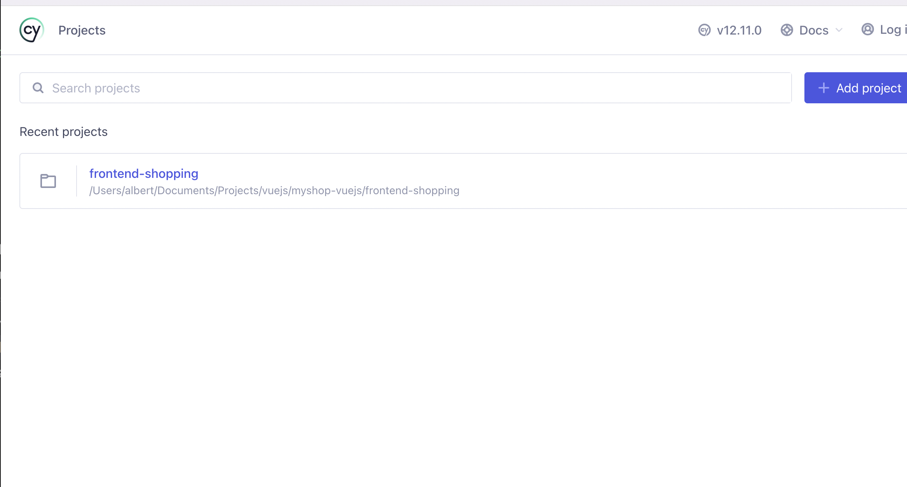
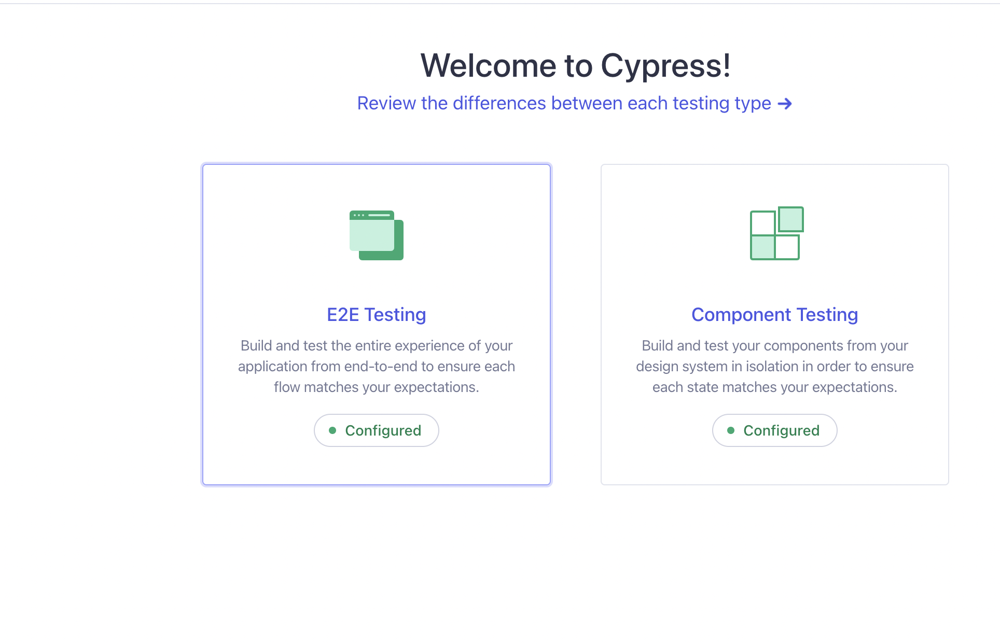
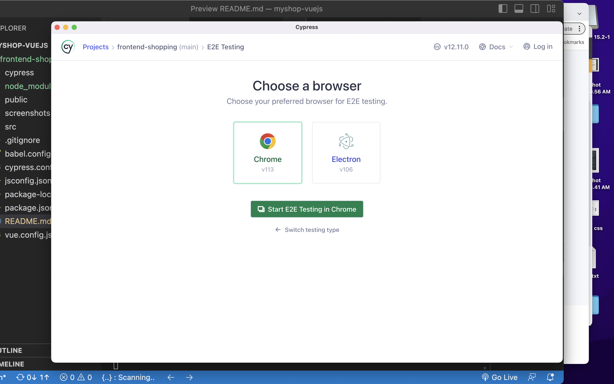
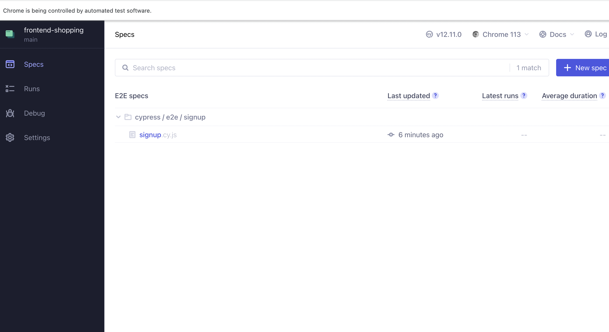
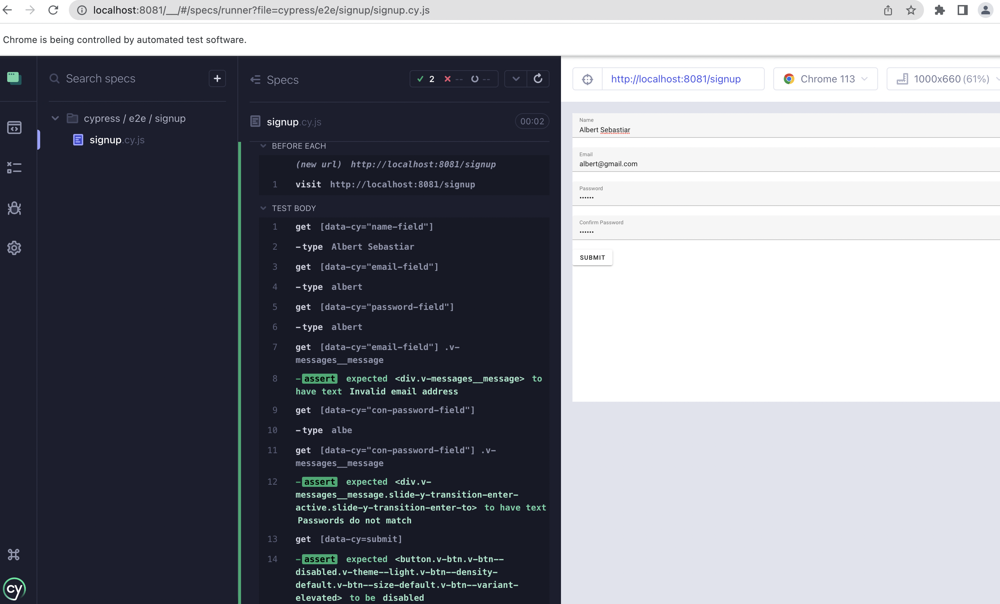

# ShopWave - An ECommerce web app

## Project setup
```
npm install
```

### Compiles and hot-reloads for development
```
npm run serve
```

### Compiles and minifies for production
```
npm run build
```

### Lints and fixes files
```
npm run lint
```

### Customize configuration
See [Configuration Reference](https://cli.vuejs.org/config/).


cypress e2e has been done for the sign up form 
```
cypress open
```
```
Follow the screens to see the test 
```




Click on the Signup :)




```
some screen shots from the application
```


